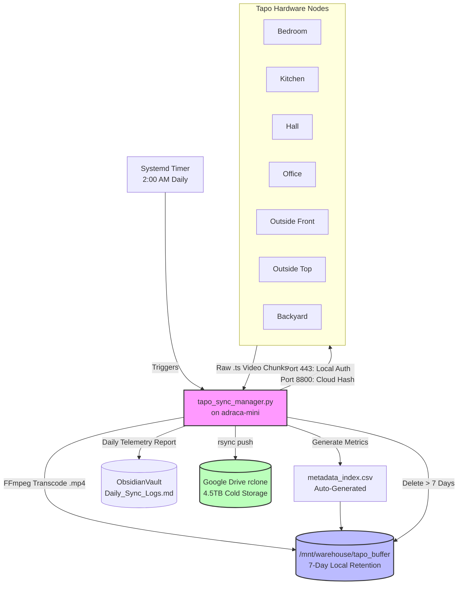

# Tapo KLAP Sovereign Pipeline

## Project Overview
This project completely automates the extraction, synchronization, and cloud-archival of 7 Tapo cameras running the encrypted KLAP firmware protocol (v1.5.0+). 

By reverse-engineering the Tapo Dual-Credential API, this system natively bypasses the `HTTP 401 Unauthorized` lockout on Port 8800 without relying on TP-Link's cloud subscriptions.

## 🏗️ Architecture Flow

## Features
- **Dual-Credential Handshake:** Uses the Local Account (`admin`) for Port 443 control requests, and automatically injects the Master Cloud Password hash into the media request payload for Port 8800.
- **Sequential Execution:** Prevents hardware starvation on weak camera SoCs by iterating through the camera array synchronously.
- **Smart Retries:** 5-minute exponential backoff for offline nodes (max 3 retries).
- **Automated CSV Indexing:** Generates rich indexing metadata for future AI analysis (timestamps, file sizes, duration).
- **Hybrid Storage:** Maintains a 7-day fast local buffer while immediately pushing completed downloads to a massive Google Drive data lake.

## XDA Developers / Publishing Draft
For the full writeup, see the draft located at:
`/home/abhishek/.gemini/antigravity-cli/brain/5eb63b3c-b642-47f7-9c07-516dc5796e5b/Tapo_KLAP_XDA_Article.md`
